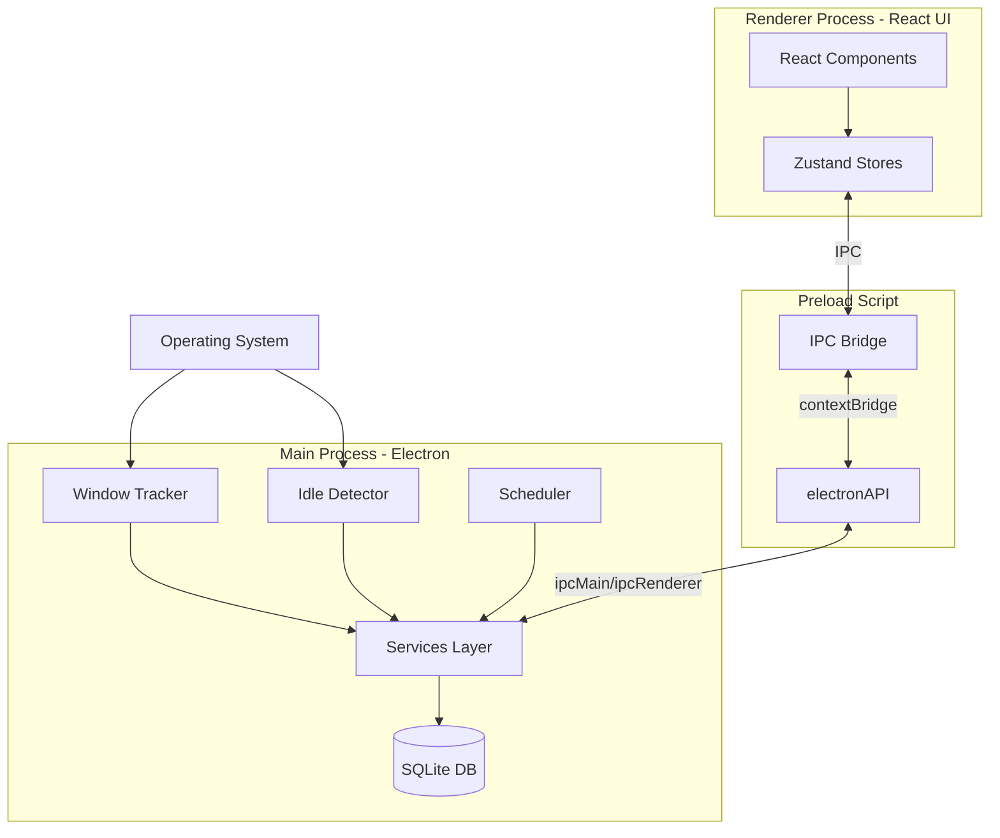
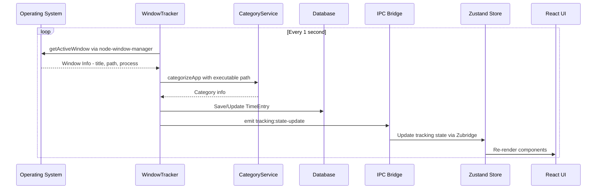
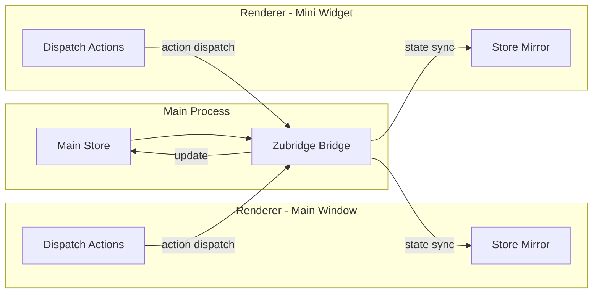
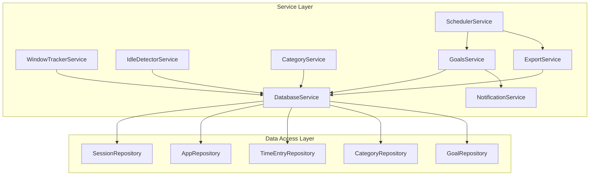
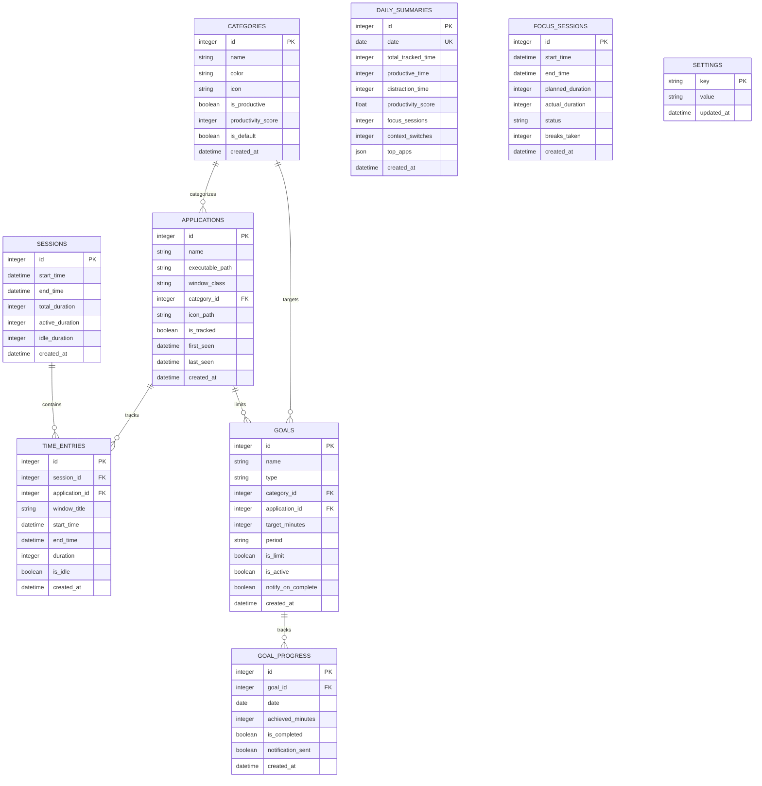
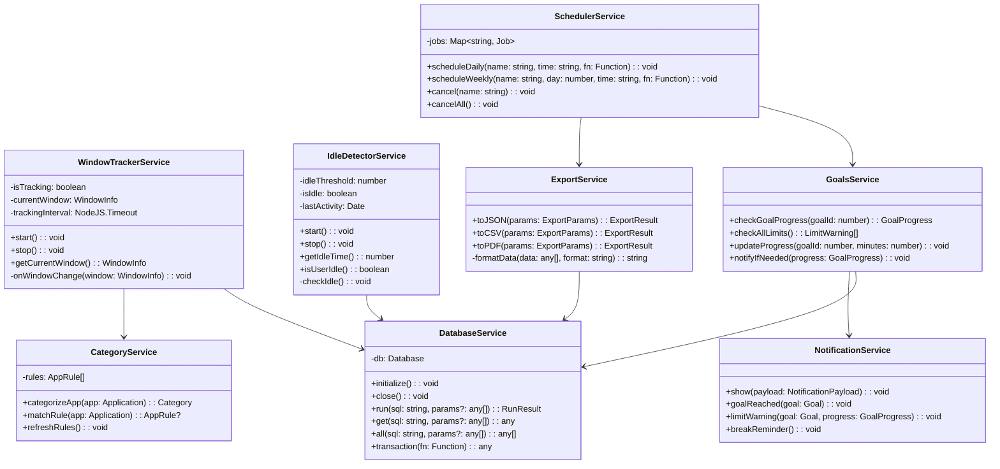
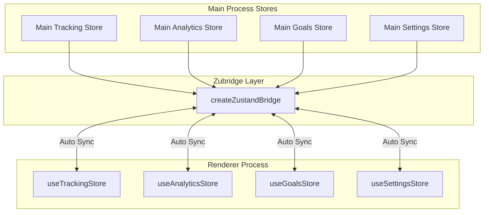
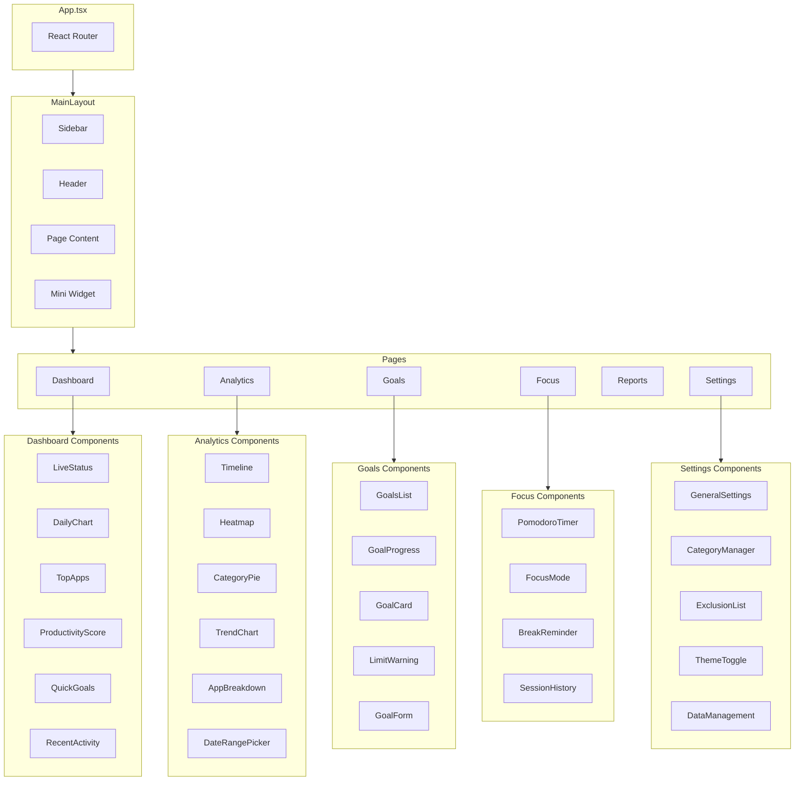

# 🏗️ Time Tracker Application - Architecture Document

## 📋 Table of Contents
1. [Overview](#overview)
2. [Tech Stack](#tech-stack)
3. [Project Structure](#project-structure)
4. [Architecture Diagrams](#architecture-diagrams)
5. [Database Schema](#database-schema)
6. [IPC Communication](#ipc-communication)
7. [Service Layer](#service-layer)
8. [State Management](#state-management)
9. [UI Components](#ui-components)
10. [Security Considerations](#security-considerations)
11. [Implementation Phases](#implementation-phases)

---

## Overview

Time Tracker is a desktop application for automatic time tracking, productivity analysis, and workflow optimization. Built with Electron, React, and TypeScript, it monitors active windows, categorizes applications, and provides detailed analytics.

### Core Features
- **Automatic Window Tracking**: Monitors active applications in real-time
- **Smart Categorization**: Auto-categorizes apps (Productive, Communication, Entertainment, etc.)
- **Idle Detection**: Detects user inactivity and pauses tracking
- **Goals & Limits**: Set productivity goals and usage limits
- **Advanced Analytics**: Charts, heatmaps, and productivity scores
- **Focus Sessions**: Pomodoro-style focus mode
- **Export & Reports**: PDF, CSV, JSON exports

---

## Tech Stack

```
┌─────────────────────────────────────────────────────────────────┐
│                        Frontend - Renderer                       │
├─────────────────────────────────────────────────────────────────┤
│  React 18 + TypeScript │ Vite │ TailwindCSS │ shadcn/ui         │
│  Recharts │ Framer Motion │ Zustand │ date-fns                  │
└─────────────────────────────────────────────────────────────────┘
                              ▼
┌─────────────────────────────────────────────────────────────────┐
│                     IPC Bridge - Preload                         │
├─────────────────────────────────────────────────────────────────┤
│  @zubridge/electron │ contextBridge │ Type-safe channels        │
└─────────────────────────────────────────────────────────────────┘
                              ▼
┌─────────────────────────────────────────────────────────────────┐
│                       Backend - Main Process                     │
├─────────────────────────────────────────────────────────────────┤
│  Electron 28+ │ node-window-manager │ better-sqlite3            │
│  node-schedule │ electron-store │ electron-builder              │
└─────────────────────────────────────────────────────────────────┘
```

### Dependencies Summary

| Category | Package | Version | Purpose |
|----------|---------|---------|---------|
| **Framework** | electron | ^28.0.0 | Desktop app framework |
| **Frontend** | react | ^18.2.0 | UI library |
| **Build** | vite | ^5.0.0 | Frontend bundler |
| **Styling** | tailwindcss | ^3.4.0 | CSS framework |
| **UI Kit** | shadcn/ui | latest | Component library |
| **State** | zustand | ^4.4.0 | State management |
| **State Sync** | @zubridge/electron | ^1.0.0 | Main/Renderer sync |
| **Charts** | recharts | ^2.10.0 | Data visualization |
| **Animation** | framer-motion | ^10.16.0 | Animations |
| **Database** | better-sqlite3 | ^9.2.0 | SQLite driver |
| **Window** | node-window-manager | ^2.2.0 | Window tracking |
| **Dates** | date-fns | ^2.30.0 | Date utilities |
| **Build** | electron-builder | ^24.9.0 | App packaging |

---

## Project Structure

```
time-tracker/
├── electron/                          # Electron main process
│   ├── main.ts                        # App entry point
│   ├── preload.ts                     # Preload script - IPC bridge
│   ├── services/                      # Backend services
│   │   ├── window-tracker.service.ts  # Active window monitoring
│   │   ├── idle-detector.service.ts   # User activity detection
│   │   ├── database.service.ts        # SQLite operations
│   │   ├── category.service.ts        # App categorization
│   │   ├── goals.service.ts           # Goals & limits management
│   │   ├── export.service.ts          # Data export - PDF/CSV/JSON
│   │   ├── notification.service.ts    # Desktop notifications
│   │   └── scheduler.service.ts       # Scheduled tasks
│   ├── database/
│   │   ├── schema.ts                  # Database schema definitions
│   │   ├── migrations/                # Database migrations
│   │   └── repositories/              # Data access layer
│   │       ├── session.repository.ts
│   │       ├── app.repository.ts
│   │       ├── time-entry.repository.ts
│   │       ├── category.repository.ts
│   │       └── goal.repository.ts
│   ├── ipc/
│   │   ├── channels.ts                # IPC channel definitions
│   │   ├── handlers.ts                # IPC handlers
│   │   └── types.ts                   # Type definitions
│   └── utils/
│       ├── logger.ts                  # Logging utility
│       └── paths.ts                   # Path utilities
│
├── src/                               # React renderer process
│   ├── main.tsx                       # React entry point
│   ├── App.tsx                        # Main app component
│   ├── components/
│   │   ├── ui/                        # shadcn/ui components
│   │   │   ├── button.tsx
│   │   │   ├── card.tsx
│   │   │   ├── chart.tsx
│   │   │   └── ...
│   │   ├── layout/
│   │   │   ├── Sidebar.tsx
│   │   │   ├── Header.tsx
│   │   │   └── MainLayout.tsx
│   │   ├── dashboard/
│   │   │   ├── LiveStatus.tsx         # Current activity
│   │   │   ├── DailyChart.tsx         # Time chart
│   │   │   ├── TopApps.tsx            # Top applications
│   │   │   └── ProductivityScore.tsx
│   │   ├── analytics/
│   │   │   ├── Timeline.tsx
│   │   │   ├── Heatmap.tsx
│   │   │   ├── CategoryPie.tsx
│   │   │   └── TrendChart.tsx
│   │   ├── goals/
│   │   │   ├── GoalsList.tsx
│   │   │   ├── GoalProgress.tsx
│   │   │   └── LimitWarning.tsx
│   │   ├── focus/
│   │   │   ├── PomodoroTimer.tsx
│   │   │   ├── FocusMode.tsx
│   │   │   └── BreakReminder.tsx
│   │   └── settings/
│   │       ├── GeneralSettings.tsx
│   │       ├── CategoryManager.tsx
│   │       ├── ExclusionList.tsx
│   │       └── ThemeToggle.tsx
│   ├── pages/
│   │   ├── Dashboard.tsx
│   │   ├── Analytics.tsx
│   │   ├── Goals.tsx
│   │   ├── Focus.tsx
│   │   ├── Reports.tsx
│   │   └── Settings.tsx
│   ├── stores/                        # Zustand stores
│   │   ├── tracking.store.ts          # Live tracking state
│   │   ├── analytics.store.ts         # Analytics data
│   │   ├── goals.store.ts             # Goals state
│   │   ├── settings.store.ts          # App settings
│   │   └── ui.store.ts                # UI state
│   ├── hooks/
│   │   ├── useTracking.ts
│   │   ├── useAnalytics.ts
│   │   ├── useGoals.ts
│   │   └── useIPC.ts
│   ├── lib/
│   │   ├── utils.ts                   # Utility functions
│   │   ├── constants.ts               # App constants
│   │   └── api.ts                     # IPC wrapper
│   ├── types/
│   │   ├── tracking.types.ts
│   │   ├── analytics.types.ts
│   │   ├── category.types.ts
│   │   └── electron.d.ts              # Electron API types
│   └── styles/
│       └── globals.css                # Global styles
│
├── resources/                         # Static resources
│   ├── icons/                         # App icons
│   └── sounds/                        # Notification sounds
│
├── package.json
├── tsconfig.json
├── tsconfig.node.json
├── vite.config.ts
├── electron-builder.json
├── tailwind.config.js
└── components.json                    # shadcn/ui config
```

---

## Architecture Diagrams

### High-Level Architecture



### Data Flow - Window Tracking



### State Synchronization with Zubridge



### Service Layer Architecture



---

## Database Schema

### Entity Relationship Diagram



### Complete SQL Schema

```sql
-- ============================================
-- Time Tracker Database Schema
-- SQLite with better-sqlite3
-- ============================================

-- Enable foreign keys
PRAGMA foreign_keys = ON;

-- ============================================
-- SESSIONS TABLE
-- Tracks user work sessions
-- ============================================
CREATE TABLE sessions (
    id INTEGER PRIMARY KEY AUTOINCREMENT,
    start_time DATETIME NOT NULL,
    end_time DATETIME,
    total_duration INTEGER DEFAULT 0,
    active_duration INTEGER DEFAULT 0,
    idle_duration INTEGER DEFAULT 0,
    created_at DATETIME DEFAULT CURRENT_TIMESTAMP
);

CREATE INDEX idx_sessions_start_time ON sessions(start_time);
CREATE INDEX idx_sessions_date ON sessions(date(start_time));

-- ============================================
-- CATEGORIES TABLE
-- Application categories for productivity scoring
-- ============================================
CREATE TABLE categories (
    id INTEGER PRIMARY KEY AUTOINCREMENT,
    name TEXT NOT NULL UNIQUE,
    color TEXT NOT NULL DEFAULT '#6366f1',
    icon TEXT,
    is_productive BOOLEAN DEFAULT 0,
    productivity_score INTEGER DEFAULT 0 
        CHECK(productivity_score >= -100 AND productivity_score <= 100),
    is_default BOOLEAN DEFAULT 0,
    created_at DATETIME DEFAULT CURRENT_TIMESTAMP
);

-- Default categories seed data
INSERT INTO categories (name, color, icon, is_productive, productivity_score, is_default) VALUES
    ('Development', '#22c55e', 'code', 1, 100, 1),
    ('Communication', '#3b82f6', 'message-circle', 1, 50, 1),
    ('Browsing', '#f59e0b', 'globe', 0, 0, 1),
    ('Entertainment', '#ef4444', 'tv', 0, -50, 1),
    ('Learning', '#8b5cf6', 'book', 1, 80, 1),
    ('Design', '#ec4899', 'palette', 1, 90, 1),
    ('Writing', '#14b8a6', 'pen-tool', 1, 85, 1),
    ('System', '#6b7280', 'settings', 0, 0, 1),
    ('Uncategorized', '#9ca3af', 'help-circle', 0, 0, 1);

-- ============================================
-- APPLICATIONS TABLE
-- Tracked applications with metadata
-- ============================================
CREATE TABLE applications (
    id INTEGER PRIMARY KEY AUTOINCREMENT,
    name TEXT NOT NULL,
    executable_path TEXT,
    window_class TEXT,
    category_id INTEGER REFERENCES categories(id) ON DELETE SET NULL,
    icon_path TEXT,
    is_tracked BOOLEAN DEFAULT 1,
    is_browser BOOLEAN DEFAULT 0,
    first_seen DATETIME DEFAULT CURRENT_TIMESTAMP,
    last_seen DATETIME DEFAULT CURRENT_TIMESTAMP,
    total_time INTEGER DEFAULT 0,
    created_at DATETIME DEFAULT CURRENT_TIMESTAMP,
    UNIQUE(name, executable_path)
);

CREATE INDEX idx_applications_name ON applications(name);
CREATE INDEX idx_applications_category ON applications(category_id);
CREATE INDEX idx_applications_tracked ON applications(is_tracked);

-- ============================================
-- TIME_ENTRIES TABLE
-- Individual time tracking records
-- ============================================
CREATE TABLE time_entries (
    id INTEGER PRIMARY KEY AUTOINCREMENT,
    session_id INTEGER REFERENCES sessions(id) ON DELETE CASCADE,
    application_id INTEGER REFERENCES applications(id) ON DELETE CASCADE,
    window_title TEXT,
    url TEXT,
    start_time DATETIME NOT NULL,
    end_time DATETIME,
    duration INTEGER DEFAULT 0,
    is_idle BOOLEAN DEFAULT 0,
    created_at DATETIME DEFAULT CURRENT_TIMESTAMP
);

CREATE INDEX idx_time_entries_session ON time_entries(session_id);
CREATE INDEX idx_time_entries_application ON time_entries(application_id);
CREATE INDEX idx_time_entries_start_time ON time_entries(start_time);
CREATE INDEX idx_time_entries_date ON time_entries(date(start_time));

-- ============================================
-- GOALS TABLE
-- Productivity goals and time limits
-- ============================================
CREATE TABLE goals (
    id INTEGER PRIMARY KEY AUTOINCREMENT,
    name TEXT NOT NULL,
    type TEXT NOT NULL CHECK(type IN ('category', 'application', 'total')),
    category_id INTEGER REFERENCES categories(id) ON DELETE CASCADE,
    application_id INTEGER REFERENCES applications(id) ON DELETE CASCADE,
    target_minutes INTEGER NOT NULL CHECK(target_minutes > 0),
    period TEXT NOT NULL DEFAULT 'daily' 
        CHECK(period IN ('daily', 'weekly', 'monthly')),
    is_limit BOOLEAN DEFAULT 0,
    is_active BOOLEAN DEFAULT 1,
    notify_on_complete BOOLEAN DEFAULT 1,
    notify_at_percentage INTEGER DEFAULT 80,
    created_at DATETIME DEFAULT CURRENT_TIMESTAMP
);

CREATE INDEX idx_goals_active ON goals(is_active);
CREATE INDEX idx_goals_category ON goals(category_id);
CREATE INDEX idx_goals_application ON goals(application_id);

-- ============================================
-- GOAL_PROGRESS TABLE
-- Daily progress tracking for goals
-- ============================================
CREATE TABLE goal_progress (
    id INTEGER PRIMARY KEY AUTOINCREMENT,
    goal_id INTEGER NOT NULL REFERENCES goals(id) ON DELETE CASCADE,
    date DATE NOT NULL,
    achieved_minutes INTEGER DEFAULT 0,
    is_completed BOOLEAN DEFAULT 0,
    notification_sent BOOLEAN DEFAULT 0,
    created_at DATETIME DEFAULT CURRENT_TIMESTAMP,
    UNIQUE(goal_id, date)
);

CREATE INDEX idx_goal_progress_date ON goal_progress(date);
CREATE INDEX idx_goal_progress_goal ON goal_progress(goal_id);

-- ============================================
-- DAILY_SUMMARIES TABLE
-- Aggregated daily statistics
-- ============================================
CREATE TABLE daily_summaries (
    id INTEGER PRIMARY KEY AUTOINCREMENT,
    date DATE NOT NULL UNIQUE,
    total_tracked_time INTEGER DEFAULT 0,
    productive_time INTEGER DEFAULT 0,
    neutral_time INTEGER DEFAULT 0,
    distraction_time INTEGER DEFAULT 0,
    productivity_score REAL DEFAULT 0.0,
    focus_sessions INTEGER DEFAULT 0,
    total_focus_time INTEGER DEFAULT 0,
    context_switches INTEGER DEFAULT 0,
    top_apps TEXT,
    top_categories TEXT,
    first_activity DATETIME,
    last_activity DATETIME,
    created_at DATETIME DEFAULT CURRENT_TIMESTAMP,
    updated_at DATETIME DEFAULT CURRENT_TIMESTAMP
);

CREATE INDEX idx_daily_summaries_date ON daily_summaries(date);

-- ============================================
-- FOCUS_SESSIONS TABLE
-- Pomodoro and focus session tracking
-- ============================================
CREATE TABLE focus_sessions (
    id INTEGER PRIMARY KEY AUTOINCREMENT,
    start_time DATETIME NOT NULL,
    end_time DATETIME,
    planned_duration INTEGER NOT NULL DEFAULT 1500,
    actual_duration INTEGER DEFAULT 0,
    break_duration INTEGER DEFAULT 300,
    status TEXT DEFAULT 'active' 
        CHECK(status IN ('active', 'completed', 'cancelled', 'interrupted')),
    breaks_taken INTEGER DEFAULT 0,
    goal_id INTEGER REFERENCES goals(id) ON DELETE SET NULL,
    notes TEXT,
    created_at DATETIME DEFAULT CURRENT_TIMESTAMP
);

CREATE INDEX idx_focus_sessions_date ON focus_sessions(date(start_time));
CREATE INDEX idx_focus_sessions_status ON focus_sessions(status);

-- ============================================
-- APP_RULES TABLE
-- Auto-categorization rules
-- ============================================
CREATE TABLE app_rules (
    id INTEGER PRIMARY KEY AUTOINCREMENT,
    pattern TEXT NOT NULL,
    pattern_type TEXT DEFAULT 'contains' 
        CHECK(pattern_type IN ('contains', 'starts_with', 'ends_with', 'regex', 'exact')),
    match_field TEXT DEFAULT 'name' 
        CHECK(match_field IN ('name', 'path', 'title', 'url')),
    category_id INTEGER REFERENCES categories(id) ON DELETE CASCADE,
    is_tracked BOOLEAN DEFAULT 1,
    priority INTEGER DEFAULT 0,
    created_at DATETIME DEFAULT CURRENT_TIMESTAMP
);

CREATE INDEX idx_app_rules_category ON app_rules(category_id);
CREATE INDEX idx_app_rules_priority ON app_rules(priority DESC);

-- Default rules for common applications
INSERT INTO app_rules (pattern, pattern_type, match_field, category_id, priority) VALUES
    ('code', 'contains', 'name', 1, 100),
    ('visual studio', 'contains', 'name', 1, 100),
    ('intellij', 'contains', 'name', 1, 100),
    ('webstorm', 'contains', 'name', 1, 100),
    ('sublime', 'contains', 'name', 1, 100),
    ('atom', 'contains', 'name', 1, 100),
    ('terminal', 'contains', 'name', 1, 90),
    ('iterm', 'contains', 'name', 1, 90),
    ('slack', 'contains', 'name', 2, 80),
    ('discord', 'contains', 'name', 2, 80),
    ('teams', 'contains', 'name', 2, 80),
    ('zoom', 'contains', 'name', 2, 80),
    ('telegram', 'contains', 'name', 2, 80),
    ('chrome', 'contains', 'name', 3, 50),
    ('firefox', 'contains', 'name', 3, 50),
    ('safari', 'contains', 'name', 3, 50),
    ('edge', 'contains', 'name', 3, 50),
    ('youtube', 'contains', 'title', 4, 70),
    ('netflix', 'contains', 'title', 4, 70),
    ('twitch', 'contains', 'title', 4, 70),
    ('spotify', 'contains', 'name', 4, 60),
    ('notion', 'contains', 'name', 5, 85),
    ('obsidian', 'contains', 'name', 5, 85),
    ('anki', 'contains', 'name', 5, 85),
    ('figma', 'contains', 'name', 6, 90),
    ('sketch', 'contains', 'name', 6, 90),
    ('photoshop', 'contains', 'name', 6, 90),
    ('illustrator', 'contains', 'name', 6, 90);

-- ============================================
-- SETTINGS TABLE
-- Application configuration
-- ============================================
CREATE TABLE settings (
    key TEXT PRIMARY KEY,
    value TEXT NOT NULL,
    updated_at DATETIME DEFAULT CURRENT_TIMESTAMP
);

-- Default settings
INSERT INTO settings (key, value) VALUES
    ('tracking_enabled', 'true'),
    ('tracking_interval', '1000'),
    ('idle_threshold', '120'),
    ('idle_action', 'pause'),
    ('start_minimized', 'false'),
    ('start_on_boot', 'true'),
    ('show_tray_icon', 'true'),
    ('show_notifications', 'true'),
    ('theme', 'system'),
    ('language', 'en'),
    ('data_retention_days', '365'),
    ('pomodoro_work_duration', '1500'),
    ('pomodoro_short_break', '300'),
    ('pomodoro_long_break', '900'),
    ('pomodoro_sessions_until_long', '4'),
    ('daily_report_time', '18:00'),
    ('weekly_report_day', '0'),
    ('export_format', 'json');

-- ============================================
-- VIEWS
-- Useful aggregated views
-- ============================================

-- Today's activity summary
CREATE VIEW today_summary AS
SELECT 
    COUNT(DISTINCT te.application_id) as apps_used,
    SUM(te.duration) as total_time,
    SUM(CASE WHEN c.is_productive = 1 THEN te.duration ELSE 0 END) as productive_time,
    SUM(CASE WHEN c.is_productive = 0 AND c.productivity_score < 0 THEN te.duration ELSE 0 END) as distraction_time,
    COUNT(DISTINCT te.id) as entry_count
FROM time_entries te
LEFT JOIN applications a ON te.application_id = a.id
LEFT JOIN categories c ON a.category_id = c.id
WHERE date(te.start_time) = date('now', 'localtime');

-- Application usage ranking
CREATE VIEW app_usage_ranking AS
SELECT 
    a.id,
    a.name,
    a.icon_path,
    c.name as category_name,
    c.color as category_color,
    c.is_productive,
    SUM(te.duration) as total_duration,
    COUNT(te.id) as session_count,
    MAX(te.end_time) as last_used
FROM applications a
LEFT JOIN time_entries te ON a.id = te.application_id
LEFT JOIN categories c ON a.category_id = c.id
WHERE te.start_time >= date('now', '-7 days')
GROUP BY a.id
ORDER BY total_duration DESC;

-- ============================================
-- TRIGGERS
-- Automatic data maintenance
-- ============================================

-- Update application last_seen on new time entry
CREATE TRIGGER update_app_last_seen
AFTER INSERT ON time_entries
BEGIN
    UPDATE applications 
    SET last_seen = NEW.start_time,
        total_time = total_time + COALESCE(NEW.duration, 0)
    WHERE id = NEW.application_id;
END;

-- Update session duration on time entry changes
CREATE TRIGGER update_session_duration
AFTER UPDATE OF duration ON time_entries
BEGIN
    UPDATE sessions 
    SET total_duration = (
        SELECT SUM(duration) FROM time_entries WHERE session_id = NEW.session_id
    ),
    active_duration = (
        SELECT SUM(duration) FROM time_entries 
        WHERE session_id = NEW.session_id AND is_idle = 0
    ),
    idle_duration = (
        SELECT SUM(duration) FROM time_entries 
        WHERE session_id = NEW.session_id AND is_idle = 1
    )
    WHERE id = NEW.session_id;
END;

-- Update daily_summaries updated_at timestamp
CREATE TRIGGER update_daily_summary_timestamp
AFTER UPDATE ON daily_summaries
BEGIN
    UPDATE daily_summaries SET updated_at = CURRENT_TIMESTAMP WHERE id = NEW.id;
END;
```

---

## IPC Communication

### Channel Naming Convention

```
<domain>:<action>

Domains: tracking, analytics, goals, settings, categories, export, focus, window
Actions: get, set, start, stop, update, delete, list, subscribe, unsubscribe
```

### IPC Channel Definitions

```typescript
// electron/ipc/channels.ts

export const IPC_CHANNELS = {
  // Tracking channels
  TRACKING: {
    START: 'tracking:start',
    STOP: 'tracking:stop',
    PAUSE: 'tracking:pause',
    RESUME: 'tracking:resume',
    GET_STATUS: 'tracking:get-status',
    STATE_UPDATE: 'tracking:state-update',
    GET_CURRENT_APP: 'tracking:get-current-app',
  },

  // Session channels
  SESSION: {
    GET_CURRENT: 'session:get-current',
    GET_BY_DATE: 'session:get-by-date',
    GET_ENTRIES: 'session:get-entries',
  },

  // Analytics channels
  ANALYTICS: {
    GET_DAILY: 'analytics:get-daily',
    GET_WEEKLY: 'analytics:get-weekly',
    GET_MONTHLY: 'analytics:get-monthly',
    GET_RANGE: 'analytics:get-range',
    GET_TOP_APPS: 'analytics:get-top-apps',
    GET_PRODUCTIVITY: 'analytics:get-productivity',
    GET_TIMELINE: 'analytics:get-timeline',
    GET_HEATMAP: 'analytics:get-heatmap',
  },

  // Goals channels
  GOALS: {
    LIST: 'goals:list',
    CREATE: 'goals:create',
    UPDATE: 'goals:update',
    DELETE: 'goals:delete',
    GET_PROGRESS: 'goals:get-progress',
    CHECK_LIMITS: 'goals:check-limits',
  },

  // Categories channels
  CATEGORIES: {
    LIST: 'categories:list',
    CREATE: 'categories:create',
    UPDATE: 'categories:update',
    DELETE: 'categories:delete',
    ASSIGN_APP: 'categories:assign-app',
  },

  // Applications channels
  APPLICATIONS: {
    LIST: 'applications:list',
    UPDATE: 'applications:update',
    SET_TRACKED: 'applications:set-tracked',
    GET_RULES: 'applications:get-rules',
    ADD_RULE: 'applications:add-rule',
    DELETE_RULE: 'applications:delete-rule',
  },

  // Settings channels
  SETTINGS: {
    GET_ALL: 'settings:get-all',
    GET: 'settings:get',
    SET: 'settings:set',
    RESET: 'settings:reset',
  },

  // Focus/Pomodoro channels
  FOCUS: {
    START: 'focus:start',
    STOP: 'focus:stop',
    PAUSE: 'focus:pause',
    RESUME: 'focus:resume',
    GET_STATUS: 'focus:get-status',
    TAKE_BREAK: 'focus:take-break',
    END_BREAK: 'focus:end-break',
    GET_HISTORY: 'focus:get-history',
  },

  // Export channels
  EXPORT: {
    TO_JSON: 'export:to-json',
    TO_CSV: 'export:to-csv',
    TO_PDF: 'export:to-pdf',
    GET_DATA: 'export:get-data',
  },

  // Window management
  WINDOW: {
    MINIMIZE: 'window:minimize',
    MAXIMIZE: 'window:maximize',
    CLOSE: 'window:close',
    SHOW_WIDGET: 'window:show-widget',
    HIDE_WIDGET: 'window:hide-widget',
  },

  // Notifications
  NOTIFICATION: {
    SHOW: 'notification:show',
    GOAL_REACHED: 'notification:goal-reached',
    LIMIT_WARNING: 'notification:limit-warning',
    BREAK_REMINDER: 'notification:break-reminder',
  },
} as const;
```

### IPC Type Definitions

```typescript
// electron/ipc/types.ts

// ============================================
// Common Types
// ============================================

export interface IPCResponse<T> {
  success: boolean;
  data?: T;
  error?: string;
}

export interface DateRangeParams {
  startDate: string; // ISO date string
  endDate: string;   // ISO date string
}

export interface PaginationParams {
  page?: number;
  limit?: number;
}

// ============================================
// Tracking Types
// ============================================

export interface TrackingStatus {
  isTracking: boolean;
  isPaused: boolean;
  currentSession: Session | null;
  currentEntry: TimeEntry | null;
  todayStats: DailySummary;
}

export interface CurrentApp {
  name: string;
  title: string;
  path: string;
  icon?: string;
  category: Category | null;
  duration: number;
}

export interface Session {
  id: number;
  startTime: string;
  endTime: string | null;
  totalDuration: number;
  activeDuration: number;
  idleDuration: number;
}

export interface TimeEntry {
  id: number;
  sessionId: number;
  applicationId: number;
  windowTitle: string;
  url?: string;
  startTime: string;
  endTime: string | null;
  duration: number;
  isIdle: boolean;
}

// ============================================
// Application Types
// ============================================

export interface Application {
  id: number;
  name: string;
  executablePath: string | null;
  windowClass: string | null;
  categoryId: number | null;
  iconPath: string | null;
  isTracked: boolean;
  isBrowser: boolean;
  firstSeen: string;
  lastSeen: string;
  totalTime: number;
}

export interface ApplicationWithCategory extends Application {
  category: Category | null;
}

export interface AppRule {
  id: number;
  pattern: string;
  patternType: 'contains' | 'starts_with' | 'ends_with' | 'regex' | 'exact';
  matchField: 'name' | 'path' | 'title' | 'url';
  categoryId: number | null;
  isTracked: boolean;
  priority: number;
}

// ============================================
// Category Types
// ============================================

export interface Category {
  id: number;
  name: string;
  color: string;
  icon: string | null;
  isProductive: boolean;
  productivityScore: number;
  isDefault: boolean;
}

export interface CategoryCreateInput {
  name: string;
  color: string;
  icon?: string;
  isProductive: boolean;
  productivityScore: number;
}

export interface CategoryUpdateInput extends Partial<CategoryCreateInput> {
  id: number;
}

// ============================================
// Goals Types
// ============================================

export interface Goal {
  id: number;
  name: string;
  type: 'category' | 'application' | 'total';
  categoryId: number | null;
  applicationId: number | null;
  targetMinutes: number;
  period: 'daily' | 'weekly' | 'monthly';
  isLimit: boolean;
  isActive: boolean;
  notifyOnComplete: boolean;
  notifyAtPercentage: number;
}

export interface GoalWithProgress extends Goal {
  progress: GoalProgress | null;
  percentComplete: number;
}

export interface GoalProgress {
  id: number;
  goalId: number;
  date: string;
  achievedMinutes: number;
  isCompleted: boolean;
  notificationSent: boolean;
}

export interface GoalCreateInput {
  name: string;
  type: 'category' | 'application' | 'total';
  categoryId?: number;
  applicationId?: number;
  targetMinutes: number;
  period: 'daily' | 'weekly' | 'monthly';
  isLimit: boolean;
  notifyOnComplete?: boolean;
  notifyAtPercentage?: number;
}

export interface GoalUpdateInput extends Partial<GoalCreateInput> {
  id: number;
  isActive?: boolean;
}

// ============================================
// Analytics Types
// ============================================

export interface DailySummary {
  date: string;
  totalTrackedTime: number;
  productiveTime: number;
  neutralTime: number;
  distractionTime: number;
  productivityScore: number;
  focusSessions: number;
  totalFocusTime: number;
  contextSwitches: number;
  topApps: AppUsage[];
  topCategories: CategoryUsage[];
  firstActivity: string | null;
  lastActivity: string | null;
}

export interface AppUsage {
  application: ApplicationWithCategory;
  duration: number;
  percentage: number;
  sessionCount: number;
}

export interface CategoryUsage {
  category: Category;
  duration: number;
  percentage: number;
  appCount: number;
}

export interface TimelineEntry {
  startTime: string;
  endTime: string;
  duration: number;
  application: ApplicationWithCategory;
  title: string;
}

export interface HeatmapData {
  day: number;    // 0-6 (Sunday-Saturday)
  hour: number;   // 0-23
  value: number;  // minutes
  productivity: number; // -100 to 100
}

export interface ProductivityTrend {
  date: string;
  score: number;
  productiveMinutes: number;
  distractionMinutes: number;
}

// ============================================
// Focus Session Types
// ============================================

export interface FocusSession {
  id: number;
  startTime: string;
  endTime: string | null;
  plannedDuration: number;
  actualDuration: number;
  breakDuration: number;
  status: 'active' | 'completed' | 'cancelled' | 'interrupted';
  breaksTaken: number;
  goalId: number | null;
  notes: string | null;
}

export interface FocusStatus {
  isActive: boolean;
  isOnBreak: boolean;
  currentSession: FocusSession | null;
  timeRemaining: number;
  breakTimeRemaining: number;
}

export interface FocusStartInput {
  duration?: number;
  goalId?: number;
  notes?: string;
}

// ============================================
// Settings Types
// ============================================

export interface AppSettings {
  trackingEnabled: boolean;
  trackingInterval: number;
  idleThreshold: number;
  idleAction: 'pause' | 'stop' | 'continue';
  startMinimized: boolean;
  startOnBoot: boolean;
  showTrayIcon: boolean;
  showNotifications: boolean;
  theme: 'light' | 'dark' | 'system';
  language: string;
  dataRetentionDays: number;
  pomodoroWorkDuration: number;
  pomodoroShortBreak: number;
  pomodoroLongBreak: number;
  pomodoroSessionsUntilLong: number;
  dailyReportTime: string;
  weeklyReportDay: number;
  exportFormat: 'json' | 'csv' | 'pdf';
}

// ============================================
// Export Types
// ============================================

export interface ExportParams {
  startDate: string;
  endDate: string;
  includeApps: boolean;
  includeCategories: boolean;
  includeGoals: boolean;
  includeTimeline: boolean;
}

export interface ExportResult {
  filePath: string;
  size: number;
  recordCount: number;
}

// ============================================
// Notification Types
// ============================================

export interface NotificationPayload {
  title: string;
  body: string;
  icon?: string;
  silent?: boolean;
  urgency?: 'low' | 'normal' | 'critical';
  actions?: NotificationAction[];
}

export interface NotificationAction {
  type: string;
  text: string;
}

// ============================================
// IPC Handler Signatures
// ============================================

export interface IPCHandlers {
  // Tracking
  [IPC_CHANNELS.TRACKING.START]: () => Promise<IPCResponse<Session>>;
  [IPC_CHANNELS.TRACKING.STOP]: () => Promise<IPCResponse<Session>>;
  [IPC_CHANNELS.TRACKING.PAUSE]: () => Promise<IPCResponse<void>>;
  [IPC_CHANNELS.TRACKING.RESUME]: () => Promise<IPCResponse<void>>;
  [IPC_CHANNELS.TRACKING.GET_STATUS]: () => Promise<IPCResponse<TrackingStatus>>;
  [IPC_CHANNELS.TRACKING.GET_CURRENT_APP]: () => Promise<IPCResponse<CurrentApp | null>>;

  // Analytics
  [IPC_CHANNELS.ANALYTICS.GET_DAILY]: (date: string) => Promise<IPCResponse<DailySummary>>;
  [IPC_CHANNELS.ANALYTICS.GET_WEEKLY]: (weekStart: string) => Promise<IPCResponse<DailySummary[]>>;
  [IPC_CHANNELS.ANALYTICS.GET_RANGE]: (params: DateRangeParams) => Promise<IPCResponse<DailySummary[]>>;
  [IPC_CHANNELS.ANALYTICS.GET_TOP_APPS]: (params: DateRangeParams & PaginationParams) => Promise<IPCResponse<AppUsage[]>>;
  [IPC_CHANNELS.ANALYTICS.GET_TIMELINE]: (date: string) => Promise<IPCResponse<TimelineEntry[]>>;
  [IPC_CHANNELS.ANALYTICS.GET_HEATMAP]: (params: DateRangeParams) => Promise<IPCResponse<HeatmapData[]>>;

  // Goals
  [IPC_CHANNELS.GOALS.LIST]: () => Promise<IPCResponse<GoalWithProgress[]>>;
  [IPC_CHANNELS.GOALS.CREATE]: (input: GoalCreateInput) => Promise<IPCResponse<Goal>>;
  [IPC_CHANNELS.GOALS.UPDATE]: (input: GoalUpdateInput) => Promise<IPCResponse<Goal>>;
  [IPC_CHANNELS.GOALS.DELETE]: (id: number) => Promise<IPCResponse<void>>;
  [IPC_CHANNELS.GOALS.GET_PROGRESS]: (goalId: number, date: string) => Promise<IPCResponse<GoalProgress>>;

  // Categories
  [IPC_CHANNELS.CATEGORIES.LIST]: () => Promise<IPCResponse<Category[]>>;
  [IPC_CHANNELS.CATEGORIES.CREATE]: (input: CategoryCreateInput) => Promise<IPCResponse<Category>>;
  [IPC_CHANNELS.CATEGORIES.UPDATE]: (input: CategoryUpdateInput) => Promise<IPCResponse<Category>>;
  [IPC_CHANNELS.CATEGORIES.DELETE]: (id: number) => Promise<IPCResponse<void>>;
  [IPC_CHANNELS.CATEGORIES.ASSIGN_APP]: (appId: number, categoryId: number) => Promise<IPCResponse<void>>;

  // Applications
  [IPC_CHANNELS.APPLICATIONS.LIST]: (params?: PaginationParams) => Promise<IPCResponse<ApplicationWithCategory[]>>;
  [IPC_CHANNELS.APPLICATIONS.SET_TRACKED]: (appId: number, tracked: boolean) => Promise<IPCResponse<void>>;
  [IPC_CHANNELS.APPLICATIONS.GET_RULES]: () => Promise<IPCResponse<AppRule[]>>;
  [IPC_CHANNELS.APPLICATIONS.ADD_RULE]: (rule: Omit<AppRule, 'id'>) => Promise<IPCResponse<AppRule>>;
  [IPC_CHANNELS.APPLICATIONS.DELETE_RULE]: (id: number) => Promise<IPCResponse<void>>;

  // Settings
  [IPC_CHANNELS.SETTINGS.GET_ALL]: () => Promise<IPCResponse<AppSettings>>;
  [IPC_CHANNELS.SETTINGS.GET]: (key: keyof AppSettings) => Promise<IPCResponse<string>>;
  [IPC_CHANNELS.SETTINGS.SET]: (key: keyof AppSettings, value: string) => Promise<IPCResponse<void>>;
  [IPC_CHANNELS.SETTINGS.RESET]: () => Promise<IPCResponse<AppSettings>>;

  // Focus
  [IPC_CHANNELS.FOCUS.START]: (input?: FocusStartInput) => Promise<IPCResponse<FocusSession>>;
  [IPC_CHANNELS.FOCUS.STOP]: () => Promise<IPCResponse<FocusSession>>;
  [IPC_CHANNELS.FOCUS.GET_STATUS]: () => Promise<IPCResponse<FocusStatus>>;
  [IPC_CHANNELS.FOCUS.TAKE_BREAK]: () => Promise<IPCResponse<void>>;
  [IPC_CHANNELS.FOCUS.GET_HISTORY]: (params: DateRangeParams) => Promise<IPCResponse<FocusSession[]>>;

  // Export
  [IPC_CHANNELS.EXPORT.TO_JSON]: (params: ExportParams) => Promise<IPCResponse<ExportResult>>;
  [IPC_CHANNELS.EXPORT.TO_CSV]: (params: ExportParams) => Promise<IPCResponse<ExportResult>>;
  [IPC_CHANNELS.EXPORT.TO_PDF]: (params: ExportParams) => Promise<IPCResponse<ExportResult>>;
}
```

### Preload Script Implementation

```typescript
// electron/preload.ts

import { contextBridge, ipcRenderer, IpcRendererEvent } from 'electron';
import { IPC_CHANNELS } from './ipc/channels';

// Whitelist of allowed channels
const ALLOWED_INVOKE_CHANNELS = Object.values(IPC_CHANNELS)
  .flatMap(group => Object.values(group));

const ALLOWED_RECEIVE_CHANNELS = [
  IPC_CHANNELS.TRACKING.STATE_UPDATE,
  IPC_CHANNELS.NOTIFICATION.GOAL_REACHED,
  IPC_CHANNELS.NOTIFICATION.LIMIT_WARNING,
  IPC_CHANNELS.NOTIFICATION.BREAK_REMINDER,
];

// Exposed API
const electronAPI = {
  // Invoke pattern - request/response
  invoke: <T>(channel: string, ...args: unknown[]): Promise<T> => {
    if (!ALLOWED_INVOKE_CHANNELS.includes(channel)) {
      throw new Error(`IPC channel "${channel}" is not allowed`);
    }
    return ipcRenderer.invoke(channel, ...args);
  },

  // Subscribe to events from main process
  on: (channel: string, callback: (...args: unknown[]) => void): (() => void) => {
    if (!ALLOWED_RECEIVE_CHANNELS.includes(channel)) {
      throw new Error(`IPC channel "${channel}" is not allowed`);
    }
    
    const subscription = (_event: IpcRendererEvent, ...args: unknown[]) => {
      callback(...args);
    };
    
    ipcRenderer.on(channel, subscription);
    
    // Return unsubscribe function
    return () => {
      ipcRenderer.removeListener(channel, subscription);
    };
  },

  // One-time event listener
  once: (channel: string, callback: (...args: unknown[]) => void): void => {
    if (!ALLOWED_RECEIVE_CHANNELS.includes(channel)) {
      throw new Error(`IPC channel "${channel}" is not allowed`);
    }
    
    ipcRenderer.once(channel, (_event: IpcRendererEvent, ...args: unknown[]) => {
      callback(...args);
    });
  },

  // Remove all listeners for a channel
  removeAllListeners: (channel: string): void => {
    ipcRenderer.removeAllListeners(channel);
  },
};

// Platform info
const platform = {
  os: process.platform,
  arch: process.arch,
  version: process.getSystemVersion(),
};

// Expose to renderer
contextBridge.exposeInMainWorld('electronAPI', electronAPI);
contextBridge.exposeInMainWorld('platform', platform);

// Type augmentation for window object
declare global {
  interface Window {
    electronAPI: typeof electronAPI;
    platform: typeof platform;
  }
}
```

### Renderer API Wrapper

```typescript
// src/lib/api.ts

import { IPC_CHANNELS } from '@electron/ipc/channels';
import type {
  IPCResponse,
  TrackingStatus,
  CurrentApp,
  Session,
  DailySummary,
  AppUsage,
  TimelineEntry,
  HeatmapData,
  GoalWithProgress,
  GoalCreateInput,
  GoalUpdateInput,
  Goal,
  Category,
  CategoryCreateInput,
  CategoryUpdateInput,
  ApplicationWithCategory,
  AppRule,
  AppSettings,
  FocusSession,
  FocusStatus,
  FocusStartInput,
  ExportParams,
  ExportResult,
  DateRangeParams,
  PaginationParams,
} from '@electron/ipc/types';

// Helper to unwrap IPC responses
async function invoke<T>(channel: string, ...args: unknown[]): Promise<T> {
  const response: IPCResponse<T> = await window.electronAPI.invoke(channel, ...args);
  if (!response.success) {
    throw new Error(response.error || 'Unknown error');
  }
  return response.data as T;
}

// ============================================
// Tracking API
// ============================================

export const trackingAPI = {
  start: () => invoke<Session>(IPC_CHANNELS.TRACKING.START),
  stop: () => invoke<Session>(IPC_CHANNELS.TRACKING.STOP),
  pause: () => invoke<void>(IPC_CHANNELS.TRACKING.PAUSE),
  resume: () => invoke<void>(IPC_CHANNELS.TRACKING.RESUME),
  getStatus: () => invoke<TrackingStatus>(IPC_CHANNELS.TRACKING.GET_STATUS),
  getCurrentApp: () => invoke<CurrentApp | null>(IPC_CHANNELS.TRACKING.GET_CURRENT_APP),
  
  // Subscribe to state updates
  onStateUpdate: (callback: (status: TrackingStatus) => void) => {
    return window.electronAPI.on(IPC_CHANNELS.TRACKING.STATE_UPDATE, callback as (...args: unknown[]) => void);
  },
};

// ============================================
// Analytics API
// ============================================

export const analyticsAPI = {
  getDaily: (date: string) => invoke<DailySummary>(IPC_CHANNELS.ANALYTICS.GET_DAILY, date),
  getWeekly: (weekStart: string) => invoke<DailySummary[]>(IPC_CHANNELS.ANALYTICS.GET_WEEKLY, weekStart),
  getRange: (params: DateRangeParams) => invoke<DailySummary[]>(IPC_CHANNELS.ANALYTICS.GET_RANGE, params),
  getTopApps: (params: DateRangeParams & PaginationParams) => 
    invoke<AppUsage[]>(IPC_CHANNELS.ANALYTICS.GET_TOP_APPS, params),
  getTimeline: (date: string) => invoke<TimelineEntry[]>(IPC_CHANNELS.ANALYTICS.GET_TIMELINE, date),
  getHeatmap: (params: DateRangeParams) => invoke<HeatmapData[]>(IPC_CHANNELS.ANALYTICS.GET_HEATMAP, params),
};

// ============================================
// Goals API
// ============================================

export const goalsAPI = {
  list: () => invoke<GoalWithProgress[]>(IPC_CHANNELS.GOALS.LIST),
  create: (input: GoalCreateInput) => invoke<Goal>(IPC_CHANNELS.GOALS.CREATE, input),
  update: (input: GoalUpdateInput) => invoke<Goal>(IPC_CHANNELS.GOALS.UPDATE, input),
  delete: (id: number) => invoke<void>(IPC_CHANNELS.GOALS.DELETE, id),
  
  // Subscribe to limit warnings
  onLimitWarning: (callback: (goal: GoalWithProgress) => void) => {
    return window.electronAPI.on(IPC_CHANNELS.NOTIFICATION.LIMIT_WARNING, callback as (...args: unknown[]) => void);
  },
  onGoalReached: (callback: (goal: GoalWithProgress) => void) => {
    return window.electronAPI.on(IPC_CHANNELS.NOTIFICATION.GOAL_REACHED, callback as (...args: unknown[]) => void);
  },
};

// ============================================
// Categories API
// ============================================

export const categoriesAPI = {
  list: () => invoke<Category[]>(IPC_CHANNELS.CATEGORIES.LIST),
  create: (input: CategoryCreateInput) => invoke<Category>(IPC_CHANNELS.CATEGORIES.CREATE, input),
  update: (input: CategoryUpdateInput) => invoke<Category>(IPC_CHANNELS.CATEGORIES.UPDATE, input),
  delete: (id: number) => invoke<void>(IPC_CHANNELS.CATEGORIES.DELETE, id),
  assignApp: (appId: number, categoryId: number) => 
    invoke<void>(IPC_CHANNELS.CATEGORIES.ASSIGN_APP, appId, categoryId),
};

// ============================================
// Applications API
// ============================================

export const applicationsAPI = {
  list: (params?: PaginationParams) => 
    invoke<ApplicationWithCategory[]>(IPC_CHANNELS.APPLICATIONS.LIST, params),
  setTracked: (appId: number, tracked: boolean) => 
    invoke<void>(IPC_CHANNELS.APPLICATIONS.SET_TRACKED, appId, tracked),
  getRules: () => invoke<AppRule[]>(IPC_CHANNELS.APPLICATIONS.GET_RULES),
  addRule: (rule: Omit<AppRule, 'id'>) => invoke<AppRule>(IPC_CHANNELS.APPLICATIONS.ADD_RULE, rule),
  deleteRule: (id: number) => invoke<void>(IPC_CHANNELS.APPLICATIONS.DELETE_RULE, id),
};

// ============================================
// Settings API
// ============================================

export const settingsAPI = {
  getAll: () => invoke<AppSettings>(IPC_CHANNELS.SETTINGS.GET_ALL),
  get: <K extends keyof AppSettings>(key: K) => 
    invoke<AppSettings[K]>(IPC_CHANNELS.SETTINGS.GET, key),
  set: <K extends keyof AppSettings>(key: K, value: AppSettings[K]) => 
    invoke<void>(IPC_CHANNELS.SETTINGS.SET, key, String(value)),
  reset: () => invoke<AppSettings>(IPC_CHANNELS.SETTINGS.RESET),
};

// ============================================
// Focus API
// ============================================

export const focusAPI = {
  start: (input?: FocusStartInput) => invoke<FocusSession>(IPC_CHANNELS.FOCUS.START, input),
  stop: () => invoke<FocusSession>(IPC_CHANNELS.FOCUS.STOP),
  pause: () => invoke<void>(IPC_CHANNELS.FOCUS.PAUSE),
  resume: () => invoke<void>(IPC_CHANNELS.FOCUS.RESUME),
  getStatus: () => invoke<FocusStatus>(IPC_CHANNELS.FOCUS.GET_STATUS),
  takeBreak: () => invoke<void>(IPC_CHANNELS.FOCUS.TAKE_BREAK),
  getHistory: (params: DateRangeParams) => 
    invoke<FocusSession[]>(IPC_CHANNELS.FOCUS.GET_HISTORY, params),
  
  // Subscribe to break reminders
  onBreakReminder: (callback: () => void) => {
    return window.electronAPI.on(IPC_CHANNELS.NOTIFICATION.BREAK_REMINDER, callback as (...args: unknown[]) => void);
  },
};

// ============================================
// Export API
// ============================================

export const exportAPI = {
  toJSON: (params: ExportParams) => invoke<ExportResult>(IPC_CHANNELS.EXPORT.TO_JSON, params),
  toCSV: (params: ExportParams) => invoke<ExportResult>(IPC_CHANNELS.EXPORT.TO_CSV, params),
  toPDF: (params: ExportParams) => invoke<ExportResult>(IPC_CHANNELS.EXPORT.TO_PDF, params),
};

// ============================================
// Window API
// ============================================

export const windowAPI = {
  minimize: () => invoke<void>(IPC_CHANNELS.WINDOW.MINIMIZE),
  maximize: () => invoke<void>(IPC_CHANNELS.WINDOW.MAXIMIZE),
  close: () => invoke<void>(IPC_CHANNELS.WINDOW.CLOSE),
  showWidget: () => invoke<void>(IPC_CHANNELS.WINDOW.SHOW_WIDGET),
  hideWidget: () => invoke<void>(IPC_CHANNELS.WINDOW.HIDE_WIDGET),
};
```

---

## Service Layer

### Service Architecture



### WindowTrackerService Implementation

```typescript
// electron/services/window-tracker.service.ts

import { windowManager, Window } from 'node-window-manager';
import { EventEmitter } from 'events';
import { DatabaseService } from './database.service';
import { CategoryService } from './category.service';

export interface WindowInfo {
  processId: number;
  path: string;
  name: string;
  title: string;
  isActive: boolean;
}

export interface TrackingState {
  isTracking: boolean;
  isPaused: boolean;
  currentWindow: WindowInfo | null;
  currentEntry: TimeEntry | null;
  sessionId: number | null;
}

export class WindowTrackerService extends EventEmitter {
  private isTracking = false;
  private isPaused = false;
  private trackingInterval: NodeJS.Timeout | null = null;
  private currentWindow: WindowInfo | null = null;
  private currentEntryId: number | null = null;
  private sessionId: number | null = null;
  
  private readonly TRACKING_INTERVAL = 1000; // 1 second
  private readonly MIN_DURATION_TO_SAVE = 2; // Minimum 2 seconds to save entry

  constructor(
    private db: DatabaseService,
    private categoryService: CategoryService
  ) {
    super();
  }

  start(): number {
    if (this.isTracking) return this.sessionId!;

    // Create new session
    const result = this.db.run(
      'INSERT INTO sessions (start_time) VALUES (?)',
      [new Date().toISOString()]
    );
    this.sessionId = result.lastInsertRowid as number;

    this.isTracking = true;
    this.isPaused = false;
    this.startTracking();
    
    this.emit('started', this.sessionId);
    return this.sessionId;
  }

  stop(): void {
    if (!this.isTracking) return;

    this.stopTracking();
    this.finalizeCurrentEntry();

    // Close session
    if (this.sessionId) {
      this.db.run(
        'UPDATE sessions SET end_time = ? WHERE id = ?',
        [new Date().toISOString(), this.sessionId]
      );
    }

    this.isTracking = false;
    this.isPaused = false;
    this.sessionId = null;
    this.currentWindow = null;
    this.currentEntryId = null;

    this.emit('stopped');
  }

  pause(): void {
    if (!this.isTracking || this.isPaused) return;
    
    this.isPaused = true;
    this.finalizeCurrentEntry();
    this.emit('paused');
  }

  resume(): void {
    if (!this.isTracking || !this.isPaused) return;
    
    this.isPaused = false;
    this.emit('resumed');
  }

  getState(): TrackingState {
    return {
      isTracking: this.isTracking,
      isPaused: this.isPaused,
      currentWindow: this.currentWindow,
      currentEntry: this.currentEntryId ? this.getCurrentEntry() : null,
      sessionId: this.sessionId,
    };
  }

  private startTracking(): void {
    this.trackingInterval = setInterval(() => {
      this.tick();
    }, this.TRACKING_INTERVAL);
  }

  private stopTracking(): void {
    if (this.trackingInterval) {
      clearInterval(this.trackingInterval);
      this.trackingInterval = null;
    }
  }

  private tick(): void {
    if (this.isPaused) return;

    const activeWindow = this.getActiveWindow();
    
    if (!activeWindow) {
      this.handleIdleWindow();
      return;
    }

    // Check if window changed
    if (this.hasWindowChanged(activeWindow)) {
      this.finalizeCurrentEntry();
      this.startNewEntry(activeWindow);
    } else {
      this.updateCurrentEntry();
    }

    this.currentWindow = activeWindow;
    this.emitStateUpdate();
  }

  private getActiveWindow(): WindowInfo | null {
    try {
      const window = windowManager.getActiveWindow();
      if (!window) return null;

      return {
        processId: window.processId,
        path: window.path,
        name: this.extractAppName(window.path),
        title: window.getTitle(),
        isActive: true,
      };
    } catch (error) {
      console.error('Failed to get active window:', error);
      return null;
    }
  }

  private extractAppName(path: string): string {
    const parts = path.split(/[/\\]/);
    const filename = parts[parts.length - 1];
    return filename.replace(/\.(exe|app)$/i, '');
  }

  private hasWindowChanged(newWindow: WindowInfo): boolean {
    if (!this.currentWindow) return true;
    return (
      this.currentWindow.path !== newWindow.path ||
      this.currentWindow.title !== newWindow.title
    );
  }

  private startNewEntry(window: WindowInfo): void {
    // Find or create application
    const app = this.findOrCreateApplication(window);
    
    // Create time entry
    const result = this.db.run(
      `INSERT INTO time_entries (session_id, application_id, window_title, start_time, duration)
       VALUES (?, ?, ?, ?, 0)`,
      [this.sessionId, app.id, window.title, new Date().toISOString()]
    );
    
    this.currentEntryId = result.lastInsertRowid as number;
    this.emit('entry:started', { entryId: this.currentEntryId, app, window });
  }

  private updateCurrentEntry(): void {
    if (!this.currentEntryId) return;

    this.db.run(
      'UPDATE time_entries SET duration = duration + 1 WHERE id = ?',
      [this.currentEntryId]
    );
  }

  private finalizeCurrentEntry(): void {
    if (!this.currentEntryId) return;

    const entry = this.db.get<{ duration: number }>(
      'SELECT duration FROM time_entries WHERE id = ?',
      [this.currentEntryId]
    );

    // Delete if too short
    if (entry && entry.duration < this.MIN_DURATION_TO_SAVE) {
      this.db.run('DELETE FROM time_entries WHERE id = ?', [this.currentEntryId]);
    } else {
      // Update end_time
      this.db.run(
        'UPDATE time_entries SET end_time = ? WHERE id = ?',
        [new Date().toISOString(), this.currentEntryId]
      );
      this.emit('entry:ended', this.currentEntryId);
    }

    this.currentEntryId = null;
  }

  private handleIdleWindow(): void {
    if (this.currentEntryId) {
      // Mark current entry as potentially idle
      this.db.run(
        'UPDATE time_entries SET is_idle = 1 WHERE id = ?',
        [this.currentEntryId]
      );
    }
  }

  private findOrCreateApplication(window: WindowInfo): { id: number } {
    // Try to find existing
    let app = this.db.get<{ id: number }>(
      'SELECT id FROM applications WHERE name = ? AND executable_path = ?',
      [window.name, window.path]
    );

    if (!app) {
      // Create new application
      const category = this.categoryService.categorizeApp(window);
      
      const result = this.db.run(
        `INSERT INTO applications (name, executable_path, category_id, first_seen, last_seen)
         VALUES (?, ?, ?, ?, ?)`,
        [window.name, window.path, category?.id || null, new Date().toISOString(), new Date().toISOString()]
      );
      
      app = { id: result.lastInsertRowid as number };
      this.emit('app:discovered', { appId: app.id, name: window.name, category });
    }

    return app;
  }

  private getCurrentEntry(): TimeEntry | null {
    if (!this.currentEntryId) return null;
    return this.db.get<TimeEntry>(
      'SELECT * FROM time_entries WHERE id = ?',
      [this.currentEntryId]
    );
  }

  private emitStateUpdate(): void {
    this.emit('state:update', this.getState());
  }
}
```

### IdleDetectorService Implementation

```typescript
// electron/services/idle-detector.service.ts

import { powerMonitor } from 'electron';
import { EventEmitter } from 'events';

export type IdleAction = 'pause' | 'stop' | 'continue';

export class IdleDetectorService extends EventEmitter {
  private isRunning = false;
  private isIdle = false;
  private idleCheckInterval: NodeJS.Timeout | null = null;
  private idleThreshold: number; // seconds
  private idleAction: IdleAction;
  
  private readonly CHECK_INTERVAL = 5000; // Check every 5 seconds

  constructor(idleThreshold = 120, idleAction: IdleAction = 'pause') {
    super();
    this.idleThreshold = idleThreshold;
    this.idleAction = idleAction;
  }

  start(): void {
    if (this.isRunning) return;

    this.isRunning = true;
    this.setupEventListeners();
    this.startIdleCheck();
    
    this.emit('started');
  }

  stop(): void {
    if (!this.isRunning) return;

    this.isRunning = false;
    this.removeEventListeners();
    this.stopIdleCheck();
    
    this.emit('stopped');
  }

  setThreshold(seconds: number): void {
    this.idleThreshold = seconds;
  }

  setAction(action: IdleAction): void {
    this.idleAction = action;
  }

  getIdleTime(): number {
    return powerMonitor.getSystemIdleTime();
  }

  isUserIdle(): boolean {
    return this.isIdle;
  }

  private setupEventListeners(): void {
    powerMonitor.on('suspend', this.handleSuspend.bind(this));
    powerMonitor.on('resume', this.handleResume.bind(this));
    powerMonitor.on('lock-screen', this.handleLockScreen.bind(this));
    powerMonitor.on('unlock-screen', this.handleUnlockScreen.bind(this));
  }

  private removeEventListeners(): void {
    powerMonitor.removeAllListeners('suspend');
    powerMonitor.removeAllListeners('resume');
    powerMonitor.removeAllListeners('lock-screen');
    powerMonitor.removeAllListeners('unlock-screen');
  }

  private startIdleCheck(): void {
    this.idleCheckInterval = setInterval(() => {
      this.checkIdle();
    }, this.CHECK_INTERVAL);
  }

  private stopIdleCheck(): void {
    if (this.idleCheckInterval) {
      clearInterval(this.idleCheckInterval);
      this.idleCheckInterval = null;
    }
  }

  private checkIdle(): void {
    const idleTime = this.getIdleTime();
    const wasIdle = this.isIdle;
    this.isIdle = idleTime >= this.idleThreshold;

    if (this.isIdle && !wasIdle) {
      this.emit('idle:start', { idleTime, action: this.idleAction });
    } else if (!this.isIdle && wasIdle) {
      this.emit('idle:end', { idleTime });
    }
  }

  private handleSuspend(): void {
    this.emit('system:suspend');
  }

  private handleResume(): void {
    this.emit('system:resume');
  }

  private handleLockScreen(): void {
    this.isIdle = true;
    this.emit('screen:locked');
  }

  private handleUnlockScreen(): void {
    this.isIdle = false;
    this.emit('screen:unlocked');
  }
}
```

---

## State Management

### Zustand Store Architecture with Zubridge



### Zustand Store Interfaces

```typescript
// src/stores/tracking.store.ts

import { create } from 'zustand';
import { subscribeWithSelector } from 'zustand/middleware';
import type { 
  TrackingStatus, 
  CurrentApp, 
  Session, 
  TimeEntry,
  DailySummary 
} from '@/types';

interface TrackingState {
  // Status
  isTracking: boolean;
  isPaused: boolean;
  isIdle: boolean;
  
  // Current data
  currentSession: Session | null;
  currentEntry: TimeEntry | null;
  currentApp: CurrentApp | null;
  
  // Today's stats
  todayStats: DailySummary | null;
  
  // Live timer
  sessionDuration: number;
  currentAppDuration: number;
  
  // Actions
  setTracking: (isTracking: boolean) => void;
  setPaused: (isPaused: boolean) => void;
  setIdle: (isIdle: boolean) => void;
  setCurrentSession: (session: Session | null) => void;
  setCurrentEntry: (entry: TimeEntry | null) => void;
  setCurrentApp: (app: CurrentApp | null) => void;
  setTodayStats: (stats: DailySummary | null) => void;
  updateDurations: (session: number, app: number) => void;
  reset: () => void;
}

const initialState = {
  isTracking: false,
  isPaused: false,
  isIdle: false,
  currentSession: null,
  currentEntry: null,
  currentApp: null,
  todayStats: null,
  sessionDuration: 0,
  currentAppDuration: 0,
};

export const useTrackingStore = create<TrackingState>()(
  subscribeWithSelector((set) => ({
    ...initialState,
    
    setTracking: (isTracking) => set({ isTracking }),
    setPaused: (isPaused) => set({ isPaused }),
    setIdle: (isIdle) => set({ isIdle }),
    setCurrentSession: (currentSession) => set({ currentSession }),
    setCurrentEntry: (currentEntry) => set({ currentEntry }),
    setCurrentApp: (currentApp) => set({ currentApp }),
    setTodayStats: (todayStats) => set({ todayStats }),
    updateDurations: (sessionDuration, currentAppDuration) => 
      set({ sessionDuration, currentAppDuration }),
    reset: () => set(initialState),
  }))
);

// Selectors
export const selectIsActive = (state: TrackingState) => 
  state.isTracking && !state.isPaused && !state.isIdle;

export const selectProductivityToday = (state: TrackingState) => 
  state.todayStats?.productivityScore ?? 0;
```

```typescript
// src/stores/analytics.store.ts

import { create } from 'zustand';
import type { 
  DailySummary, 
  AppUsage, 
  CategoryUsage,
  TimelineEntry,
  HeatmapData,
  ProductivityTrend,
  DateRangeParams 
} from '@/types';

interface AnalyticsState {
  // Data
  dailySummary: DailySummary | null;
  weeklySummaries: DailySummary[];
  monthlySummaries: DailySummary[];
  topApps: AppUsage[];
  topCategories: CategoryUsage[];
  timeline: TimelineEntry[];
  heatmap: HeatmapData[];
  productivityTrend: ProductivityTrend[];
  
  // Selection
  selectedDate: string;
  dateRange: DateRangeParams;
  
  // Loading states
  isLoading: boolean;
  error: string | null;
  
  // Actions
  setDailySummary: (summary: DailySummary | null) => void;
  setWeeklySummaries: (summaries: DailySummary[]) => void;
  setMonthlySummaries: (summaries: DailySummary[]) => void;
  setTopApps: (apps: AppUsage[]) => void;
  setTopCategories: (categories: CategoryUsage[]) => void;
  setTimeline: (entries: TimelineEntry[]) => void;
  setHeatmap: (data: HeatmapData[]) => void;
  setProductivityTrend: (trend: ProductivityTrend[]) => void;
  setSelectedDate: (date: string) => void;
  setDateRange: (range: DateRangeParams) => void;
  setLoading: (isLoading: boolean) => void;
  setError: (error: string | null) => void;
  reset: () => void;
}

export const useAnalyticsStore = create<AnalyticsState>((set) => ({
  dailySummary: null,
  weeklySummaries: [],
  monthlySummaries: [],
  topApps: [],
  topCategories: [],
  timeline: [],
  heatmap: [],
  productivityTrend: [],
  selectedDate: new Date().toISOString().split('T')[0],
  dateRange: {
    startDate: new Date().toISOString().split('T')[0],
    endDate: new Date().toISOString().split('T')[0],
  },
  isLoading: false,
  error: null,

  setDailySummary: (dailySummary) => set({ dailySummary }),
  setWeeklySummaries: (weeklySummaries) => set({ weeklySummaries }),
  setMonthlySummaries: (monthlySummaries) => set({ monthlySummaries }),
  setTopApps: (topApps) => set({ topApps }),
  setTopCategories: (topCategories) => set({ topCategories }),
  setTimeline: (timeline) => set({ timeline }),
  setHeatmap: (heatmap) => set({ heatmap }),
  setProductivityTrend: (productivityTrend) => set({ productivityTrend }),
  setSelectedDate: (selectedDate) => set({ selectedDate }),
  setDateRange: (dateRange) => set({ dateRange }),
  setLoading: (isLoading) => set({ isLoading }),
  setError: (error) => set({ error }),
  reset: () => set({
    dailySummary: null,
    weeklySummaries: [],
    monthlySummaries: [],
    topApps: [],
    topCategories: [],
    timeline: [],
    heatmap: [],
    productivityTrend: [],
    isLoading: false,
    error: null,
  }),
}));
```

```typescript
// src/stores/goals.store.ts

import { create } from 'zustand';
import type { 
  Goal, 
  GoalWithProgress, 
  GoalCreateInput,
  GoalUpdateInput 
} from '@/types';

interface GoalsState {
  // Data
  goals: GoalWithProgress[];
  activeGoals: GoalWithProgress[];
  limits: GoalWithProgress[];
  
  // Warnings
  limitWarnings: GoalWithProgress[];
  recentlyCompleted: GoalWithProgress[];
  
  // UI State
  selectedGoal: GoalWithProgress | null;
  isCreating: boolean;
  isEditing: boolean;
  
  // Loading
  isLoading: boolean;
  error: string | null;
  
  // Actions
  setGoals: (goals: GoalWithProgress[]) => void;
  addGoal: (goal: GoalWithProgress) => void;
  updateGoal: (goal: GoalWithProgress) => void;
  removeGoal: (id: number) => void;
  setLimitWarnings: (warnings: GoalWithProgress[]) => void;
  addLimitWarning: (warning: GoalWithProgress) => void;
  clearLimitWarning: (id: number) => void;
  markCompleted: (goal: GoalWithProgress) => void;
  setSelectedGoal: (goal: GoalWithProgress | null) => void;
  setIsCreating: (isCreating: boolean) => void;
  setIsEditing: (isEditing: boolean) => void;
  setLoading: (isLoading: boolean) => void;
  setError: (error: string | null) => void;
}

export const useGoalsStore = create<GoalsState>((set, get) => ({
  goals: [],
  activeGoals: [],
  limits: [],
  limitWarnings: [],
  recentlyCompleted: [],
  selectedGoal: null,
  isCreating: false,
  isEditing: false,
  isLoading: false,
  error: null,

  setGoals: (goals) => set({
    goals,
    activeGoals: goals.filter(g => g.isActive && !g.isLimit),
    limits: goals.filter(g => g.isActive && g.isLimit),
  }),
  
  addGoal: (goal) => set((state) => ({
    goals: [...state.goals, goal],
    activeGoals: goal.isActive && !goal.isLimit 
      ? [...state.activeGoals, goal] 
      : state.activeGoals,
    limits: goal.isActive && goal.isLimit 
      ? [...state.limits, goal] 
      : state.limits,
  })),
  
  updateGoal: (updatedGoal) => set((state) => {
    const goals = state.goals.map(g => 
      g.id === updatedGoal.id ? updatedGoal : g
    );
    return {
      goals,
      activeGoals: goals.filter(g => g.isActive && !g.isLimit),
      limits: goals.filter(g => g.isActive && g.isLimit),
    };
  }),
  
  removeGoal: (id) => set((state) => ({
    goals: state.goals.filter(g => g.id !== id),
    activeGoals: state.activeGoals.filter(g => g.id !== id),
    limits: state.limits.filter(g => g.id !== id),
  })),
  
  setLimitWarnings: (limitWarnings) => set({ limitWarnings }),
  
  addLimitWarning: (warning) => set((state) => ({
    limitWarnings: state.limitWarnings.some(w => w.id === warning.id)
      ? state.limitWarnings
      : [...state.limitWarnings, warning],
  })),
  
  clearLimitWarning: (id) => set((state) => ({
    limitWarnings: state.limitWarnings.filter(w => w.id !== id),
  })),
  
  markCompleted: (goal) => set((state) => ({
    recentlyCompleted: [...state.recentlyCompleted.slice(-4), goal],
  })),
  
  setSelectedGoal: (selectedGoal) => set({ selectedGoal }),
  setIsCreating: (isCreating) => set({ isCreating }),
  setIsEditing: (isEditing) => set({ isEditing }),
  setLoading: (isLoading) => set({ isLoading }),
  setError: (error) => set({ error }),
}));
```

```typescript
// src/stores/settings.store.ts

import { create } from 'zustand';
import { persist } from 'zustand/middleware';
import type { AppSettings } from '@/types';

interface SettingsState extends AppSettings {
  // Derived states
  isDarkMode: boolean;
  
  // Actions
  setSetting: <K extends keyof AppSettings>(key: K, value: AppSettings[K]) => void;
  setSettings: (settings: Partial<AppSettings>) => void;
  resetSettings: () => void;
  loadFromBackend: (settings: AppSettings) => void;
}

const defaultSettings: AppSettings = {
  trackingEnabled: true,
  trackingInterval: 1000,
  idleThreshold: 120,
  idleAction: 'pause',
  startMinimized: false,
  startOnBoot: true,
  showTrayIcon: true,
  showNotifications: true,
  theme: 'system',
  language: 'en',
  dataRetentionDays: 365,
  pomodoroWorkDuration: 1500,
  pomodoroShortBreak: 300,
  pomodoroLongBreak: 900,
  pomodoroSessionsUntilLong: 4,
  dailyReportTime: '18:00',
  weeklyReportDay: 0,
  exportFormat: 'json',
};

export const useSettingsStore = create<SettingsState>()(
  persist(
    (set, get) => ({
      ...defaultSettings,
      isDarkMode: false,

      setSetting: (key, value) => set({ [key]: value }),
      
      setSettings: (settings) => set(settings),
      
      resetSettings: () => set(defaultSettings),
      
      loadFromBackend: (settings) => set({
        ...settings,
        isDarkMode: settings.theme === 'dark' || 
          (settings.theme === 'system' && 
           window.matchMedia('(prefers-color-scheme: dark)').matches),
      }),
    }),
    {
      name: 'time-tracker-settings',
      partialize: (state) => ({
        theme: state.theme,
        language: state.language,
      }),
    }
  )
);
```

```typescript
// src/stores/ui.store.ts

import { create } from 'zustand';

type Page = 'dashboard' | 'analytics' | 'goals' | 'focus' | 'reports' | 'settings';
type ModalType = 'goal-create' | 'goal-edit' | 'category-create' | 'category-edit' | 
                 'app-settings' | 'export' | 'confirm-delete' | null;

interface UIState {
  // Navigation
  currentPage: Page;
  previousPage: Page | null;
  
  // Sidebar
  isSidebarCollapsed: boolean;
  isSidebarHovered: boolean;
  
  // Modals
  activeModal: ModalType;
  modalData: unknown;
  
  // Notifications
  toasts: Toast[];
  
  // Widget
  isWidgetVisible: boolean;
  
  // Actions
  navigateTo: (page: Page) => void;
  goBack: () => void;
  toggleSidebar: () => void;
  setSidebarCollapsed: (collapsed: boolean) => void;
  setSidebarHovered: (hovered: boolean) => void;
  openModal: (type: ModalType, data?: unknown) => void;
  closeModal: () => void;
  addToast: (toast: Omit<Toast, 'id'>) => void;
  removeToast: (id: string) => void;
  setWidgetVisible: (visible: boolean) => void;
}

interface Toast {
  id: string;
  type: 'success' | 'error' | 'warning' | 'info';
  title: string;
  message?: string;
  duration?: number;
}

export const useUIStore = create<UIState>((set, get) => ({
  currentPage: 'dashboard',
  previousPage: null,
  isSidebarCollapsed: false,
  isSidebarHovered: false,
  activeModal: null,
  modalData: null,
  toasts: [],
  isWidgetVisible: false,

  navigateTo: (page) => set((state) => ({
    currentPage: page,
    previousPage: state.currentPage,
  })),
  
  goBack: () => set((state) => ({
    currentPage: state.previousPage || 'dashboard',
    previousPage: null,
  })),
  
  toggleSidebar: () => set((state) => ({
    isSidebarCollapsed: !state.isSidebarCollapsed,
  })),
  
  setSidebarCollapsed: (isSidebarCollapsed) => set({ isSidebarCollapsed }),
  setSidebarHovered: (isSidebarHovered) => set({ isSidebarHovered }),
  
  openModal: (activeModal, modalData = null) => set({ activeModal, modalData }),
  closeModal: () => set({ activeModal: null, modalData: null }),
  
  addToast: (toast) => set((state) => ({
    toasts: [...state.toasts, { ...toast, id: crypto.randomUUID() }],
  })),
  
  removeToast: (id) => set((state) => ({
    toasts: state.toasts.filter(t => t.id !== id),
  })),
  
  setWidgetVisible: (isWidgetVisible) => set({ isWidgetVisible }),
}));
```

### Zubridge Setup

```typescript
// electron/store/bridge.ts

import { createZustandBridge } from '@zubridge/electron/main';
import { BrowserWindow } from 'electron';
import { useMainTrackingStore } from './main-tracking.store';
import { useMainAnalyticsStore } from './main-analytics.store';
import { useMainGoalsStore } from './main-goals.store';
import { useMainSettingsStore } from './main-settings.store';

let bridges: ReturnType<typeof createZustandBridge>[] = [];

export function setupStoreBridges(windows: BrowserWindow[]): void {
  // Cleanup existing bridges
  bridges.forEach(bridge => bridge.unsubscribe());
  bridges = [];

  // Create bridges for each store
  bridges.push(
    createZustandBridge(useMainTrackingStore, windows, {
      channel: 'zubridge:tracking',
    }),
    createZustandBridge(useMainAnalyticsStore, windows, {
      channel: 'zubridge:analytics',
    }),
    createZustandBridge(useMainGoalsStore, windows, {
      channel: 'zubridge:goals',
    }),
    createZustandBridge(useMainSettingsStore, windows, {
      channel: 'zubridge:settings',
    })
  );
}

export function cleanupStoreBridges(): void {
  bridges.forEach(bridge => bridge.unsubscribe());
  bridges = [];
}
```

---

## UI Components

### Component Tree



### Component Specifications

#### Layout Components

| Component | File | Description | Props |
|-----------|------|-------------|-------|
| `MainLayout` | [`layout/MainLayout.tsx`](src/components/layout/MainLayout.tsx) | Root layout wrapper | `children` |
| `Sidebar` | [`layout/Sidebar.tsx`](src/components/layout/Sidebar.tsx) | Navigation sidebar | `collapsed`, `onToggle` |
| `Header` | [`layout/Header.tsx`](src/components/layout/Header.tsx) | Top header bar | `title`, `actions` |
| `PageContainer` | [`layout/PageContainer.tsx`](src/components/layout/PageContainer.tsx) | Page wrapper with padding | `title`, `subtitle`, `actions`, `children` |

#### Dashboard Components

| Component | File | Description | Props |
|-----------|------|-------------|-------|
| `LiveStatus` | [`dashboard/LiveStatus.tsx`](src/components/dashboard/LiveStatus.tsx) | Current tracking status card | `status`, `currentApp` |
| `DailyChart` | [`dashboard/DailyChart.tsx`](src/components/dashboard/DailyChart.tsx) | Time distribution chart | `data`, `selectedDate` |
| `TopApps` | [`dashboard/TopApps.tsx`](src/components/dashboard/TopApps.tsx) | Top applications list | `apps`, `limit` |
| `ProductivityScore` | [`dashboard/ProductivityScore.tsx`](src/components/dashboard/ProductivityScore.tsx) | Circular progress score | `score`, `trend` |
| `QuickGoals` | [`dashboard/QuickGoals.tsx`](src/components/dashboard/QuickGoals.tsx) | Goals summary widget | `goals` |
| `RecentActivity` | [`dashboard/RecentActivity.tsx`](src/components/dashboard/RecentActivity.tsx) | Recent time entries | `entries`, `limit` |

#### Analytics Components

| Component | File | Description | Props |
|-----------|------|-------------|-------|
| `Timeline` | [`analytics/Timeline.tsx`](src/components/analytics/Timeline.tsx) | Activity timeline | `entries`, `height` |
| `Heatmap` | [`analytics/Heatmap.tsx`](src/components/analytics/Heatmap.tsx) | Weekly activity heatmap | `data` |
| `CategoryPie` | [`analytics/CategoryPie.tsx`](src/components/analytics/CategoryPie.tsx) | Category distribution | `categories` |
| `TrendChart` | [`analytics/TrendChart.tsx`](src/components/analytics/TrendChart.tsx) | Productivity trend line | `data`, `period` |
| `AppBreakdown` | [`analytics/AppBreakdown.tsx`](src/components/analytics/AppBreakdown.tsx) | Detailed app stats | `apps` |
| `DateRangePicker` | [`analytics/DateRangePicker.tsx`](src/components/analytics/DateRangePicker.tsx) | Date range selector | `value`, `onChange` |

#### Goals Components

| Component | File | Description | Props |
|-----------|------|-------------|-------|
| `GoalsList` | [`goals/GoalsList.tsx`](src/components/goals/GoalsList.tsx) | List of all goals | `goals`, `onSelect` |
| `GoalCard` | [`goals/GoalCard.tsx`](src/components/goals/GoalCard.tsx) | Individual goal card | `goal`, `onEdit`, `onDelete` |
| `GoalProgress` | [`goals/GoalProgress.tsx`](src/components/goals/GoalProgress.tsx) | Goal progress bar | `goal`, `progress` |
| `LimitWarning` | [`goals/LimitWarning.tsx`](src/components/goals/LimitWarning.tsx) | Usage limit alert | `limit`, `current`, `onDismiss` |
| `GoalForm` | [`goals/GoalForm.tsx`](src/components/goals/GoalForm.tsx) | Create/edit goal form | `goal?`, `onSubmit`, `onCancel` |

#### Focus Components

| Component | File | Description | Props |
|-----------|------|-------------|-------|
| `PomodoroTimer` | [`focus/PomodoroTimer.tsx`](src/components/focus/PomodoroTimer.tsx) | Countdown timer | `duration`, `onComplete` |
| `FocusMode` | [`focus/FocusMode.tsx`](src/components/focus/FocusMode.tsx) | Focus session UI | `session`, `onStop` |
| `BreakReminder` | [`focus/BreakReminder.tsx`](src/components/focus/BreakReminder.tsx) | Break notification | `onTakeBreak`, `onSkip` |
| `SessionHistory` | [`focus/SessionHistory.tsx`](src/components/focus/SessionHistory.tsx) | Past focus sessions | `sessions` |

#### Settings Components

| Component | File | Description | Props |
|-----------|------|-------------|-------|
| `GeneralSettings` | [`settings/GeneralSettings.tsx`](src/components/settings/GeneralSettings.tsx) | Core app settings | `settings`, `onChange` |
| `CategoryManager` | [`settings/CategoryManager.tsx`](src/components/settings/CategoryManager.tsx) | Manage categories | `categories`, `onUpdate` |
| `ExclusionList` | [`settings/ExclusionList.tsx`](src/components/settings/ExclusionList.tsx) | Excluded apps list | `apps`, `onToggle` |
| `ThemeToggle` | [`settings/ThemeToggle.tsx`](src/components/settings/ThemeToggle.tsx) | Light/dark/system | `theme`, `onChange` |
| `DataManagement` | [`settings/DataManagement.tsx`](src/components/settings/DataManagement.tsx) | Export/import data | `onExport`, `onImport` |

---

## Security Considerations

### Electron Security Best Practices

```typescript
// electron/main.ts - Security configuration

import { app, BrowserWindow, session } from 'electron';

function createSecureWindow(): BrowserWindow {
  const win = new BrowserWindow({
    width: 1200,
    height: 800,
    webPreferences: {
      // CRITICAL: Enable context isolation
      contextIsolation: true,
      
      // CRITICAL: Disable Node.js integration in renderer
      nodeIntegration: false,
      
      // CRITICAL: Disable remote module
      enableRemoteModule: false,
      
      // Use preload script for IPC
      preload: path.join(__dirname, 'preload.js'),
      
      // Disable web security only in development
      webSecurity: !isDev,
      
      // Sandbox the renderer
      sandbox: true,
      
      // Disable eval and new Function
      allowRunningInsecureContent: false,
    },
  });

  // Set Content Security Policy
  session.defaultSession.webRequest.onHeadersReceived((details, callback) => {
    callback({
      responseHeaders: {
        ...details.responseHeaders,
        'Content-Security-Policy': [
          "default-src 'self'",
          "script-src 'self'",
          "style-src 'self' 'unsafe-inline'",
          "img-src 'self' data: blob:",
          "font-src 'self'",
          "connect-src 'self'",
        ].join('; '),
      },
    });
  });

  return win;
}
```

### Security Checklist

| Category | Measure | Status | Implementation |
|----------|---------|--------|----------------|
| **Context Isolation** | Enable `contextIsolation` | ✅ Required | [`main.ts`](electron/main.ts:15) |
| **Node Integration** | Disable `nodeIntegration` | ✅ Required | [`main.ts`](electron/main.ts:18) |
| **Preload Scripts** | Use for IPC only | ✅ Required | [`preload.ts`](electron/preload.ts) |
| **Channel Whitelist** | Whitelist IPC channels | ✅ Required | [`preload.ts`](electron/preload.ts:8) |
| **Remote Module** | Disable completely | ✅ Required | [`main.ts`](electron/main.ts:21) |
| **Sandbox** | Enable renderer sandbox | ✅ Required | [`main.ts`](electron/main.ts:27) |
| **CSP** | Set Content-Security-Policy | ✅ Required | [`main.ts`](electron/main.ts:35) |
| **Web Security** | Keep enabled in production | ✅ Required | [`main.ts`](electron/main.ts:24) |
| **Protocol Handlers** | Register custom protocols | ⚠️ Optional | For deep linking |
| **Updates** | Secure auto-update | ⚠️ Optional | electron-updater |

### Data Privacy

```typescript
// electron/services/privacy.service.ts

export class PrivacyService {
  private sensitivePatterns = [
    /password/i,
    /secret/i,
    /api[_-]?key/i,
    /token/i,
    /credit[_-]?card/i,
  ];

  // Sanitize window titles before storing
  sanitizeTitle(title: string): string {
    // Remove potential sensitive data from titles
    let sanitized = title;
    
    // Mask URLs with credentials
    sanitized = sanitized.replace(
      /([a-z]+:\/\/)([^:]+):([^@]+)@/gi,
      '$1***:***@'
    );
    
    // Mask potential passwords in titles
    for (const pattern of this.sensitivePatterns) {
      if (pattern.test(sanitized)) {
        sanitized = sanitized.replace(
          /[:=]\s*\S+/g, 
          ': [REDACTED]'
        );
      }
    }
    
    return sanitized;
  }

  // Check if an app should be excluded from tracking
  shouldExcludeApp(appName: string, windowTitle: string): boolean {
    const excludedApps = [
      /password/i,
      /keychain/i,
      /1password/i,
      /lastpass/i,
      /bitwarden/i,
      /keepass/i,
    ];
    
    return excludedApps.some(pattern => 
      pattern.test(appName) || pattern.test(windowTitle)
    );
  }

  // Data retention cleanup
  async cleanupOldData(retentionDays: number): Promise<number> {
    const cutoffDate = new Date();
    cutoffDate.setDate(cutoffDate.getDate() - retentionDays);
    
    // Delete old time entries and orphaned data
    // Returns count of deleted records
    return 0; // Implementation
  }
}
```

### Preload Script Security Pattern

```typescript
// electron/preload.ts - Secure IPC bridge

import { contextBridge, ipcRenderer } from 'electron';

// Define allowed channels explicitly
const ALLOWED_CHANNELS = {
  invoke: [
    'tracking:start',
    'tracking:stop',
    'tracking:get-status',
    // ... other channels
  ] as const,
  receive: [
    'tracking:state-update',
    'notification:show',
    // ... other channels
  ] as const,
};

// Type-safe channel validation
function isAllowedInvokeChannel(channel: string): channel is typeof ALLOWED_CHANNELS.invoke[number] {
  return (ALLOWED_CHANNELS.invoke as readonly string[]).includes(channel);
}

function isAllowedReceiveChannel(channel: string): channel is typeof ALLOWED_CHANNELS.receive[number] {
  return (ALLOWED_CHANNELS.receive as readonly string[]).includes(channel);
}

// Expose minimal, validated API
contextBridge.exposeInMainWorld('electronAPI', {
  invoke: async (channel: string, ...args: unknown[]) => {
    if (!isAllowedInvokeChannel(channel)) {
      console.error(`Blocked IPC invoke to unauthorized channel: ${channel}`);
      throw new Error('Unauthorized IPC channel');
    }
    return ipcRenderer.invoke(channel, ...args);
  },
  
  on: (channel: string, callback: (...args: unknown[]) => void) => {
    if (!isAllowedReceiveChannel(channel)) {
      console.error(`Blocked IPC listener on unauthorized channel: ${channel}`);
      return () => {};
    }
    
    const subscription = (_event: Electron.IpcRendererEvent, ...args: unknown[]) => {
      // Don't pass event object to renderer
      callback(...args);
    };
    
    ipcRenderer.on(channel, subscription);
    return () => ipcRenderer.removeListener(channel, subscription);
  },
});
```

---

## Implementation Phases

### Phase 1: Core Foundation (Week 1-2)
- [x] Project setup with Vite + Electron
- [ ] Database schema implementation
- [ ] Basic window tracking service
- [ ] IPC communication layer
- [ ] Main/Renderer state sync with Zubridge

### Phase 2: Basic Tracking (Week 3-4)
- [ ] Window tracker service
- [ ] Idle detection service
- [ ] Session management
- [ ] Basic dashboard UI
- [ ] System tray integration

### Phase 3: Analytics & Categories (Week 5-6)
- [ ] Category service & auto-categorization
- [ ] Analytics calculations
- [ ] Charts and visualizations
- [ ] Timeline view
- [ ] Heatmap component

### Phase 4: Goals & Productivity (Week 7-8)
- [ ] Goals service
- [ ] Goal progress tracking
- [ ] Limit warnings & notifications
- [ ] Productivity scoring
- [ ] Daily/weekly reports

### Phase 5: Focus Mode (Week 9)
- [ ] Pomodoro timer
- [ ] Focus session tracking
- [ ] Break reminders
- [ ] Session history

### Phase 6: Polish & Export (Week 10)
- [ ] Export service (PDF, CSV, JSON)
- [ ] Settings management
- [ ] UI polish & animations
- [ ] Performance optimization

### Phase 7: Testing & Release (Week 11-12)
- [ ] Unit tests
- [ ] Integration tests
- [ ] E2E tests
- [ ] App packaging
- [ ] Auto-updates setup

---

## Appendix

### File Naming Conventions

```
Components:   PascalCase.tsx      (e.g., LiveStatus.tsx)
Stores:       kebab-case.store.ts (e.g., tracking.store.ts)
Services:     kebab-case.service.ts (e.g., window-tracker.service.ts)
Types:        kebab-case.types.ts (e.g., tracking.types.ts)
Hooks:        camelCase.ts        (e.g., useTracking.ts)
Utils:        kebab-case.ts       (e.g., date-utils.ts)
```

### Import Aliases

```json
// tsconfig.json paths
{
  "compilerOptions": {
    "paths": {
      "@/*": ["./src/*"],
      "@components/*": ["./src/components/*"],
      "@stores/*": ["./src/stores/*"],
      "@hooks/*": ["./src/hooks/*"],
      "@lib/*": ["./src/lib/*"],
      "@types/*": ["./src/types/*"],
      "@electron/*": ["./electron/*"]
    }
  }
}
```

### Environment Variables

```env
# .env.development
VITE_DEV_SERVER_URL=http://localhost:5173
VITE_LOG_LEVEL=debug
ELECTRON_IS_DEV=1

# .env.production
VITE_LOG_LEVEL=error
ELECTRON_IS_DEV=0
```

---

*Document Version: 1.0.0*
*Last Updated: 2024*
*Author: Architecture Team*
